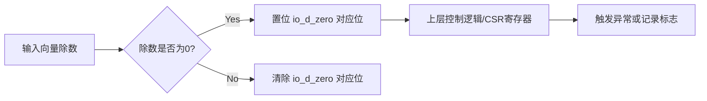

# VectorIdiv_bug_1 深度分析报告

## 📊 缺陷概览

**文件位置**: `bug_file/VectorIdiv_bug_1.v`  
**Bug 行号**: 第 5240 行  
**影响范围**: 向量整数除法器顶层模块接口  
**严重等级**: 🔴 **高危** - 导致除零异常检测功能完全失效，可能引发静默数据错误  
**缺陷类型**: 信号赋值错误 - 关键状态标志位被硬编码为常量 0

---

## 🔍 缺陷定位

### 缺陷位置

**Bug 文件 (第 5240 行)**:

```verilog
assign io_d_zero = 16'h0; // ❌ 错误: 除零标志位被强制拉低，永远不报错
```

### 信号映射关系

通过分析顶层模块 VectorIdiv 的逻辑，发现 Bug 文件虽然保留了除零检测的计算逻辑，但切断了输出路径：

| 原始信号                    | Bug 文件逻辑 | 功能说明                                           |
| --------------------------- | ------------ | -------------------------------------------------- |
| `io_d_zero`                 | `io_d_zero`  | 输出端口：指示对应的向量元素计算是否发生除以零错误 |
| `div_out_d_zero_result_reg` | (未直接连接) | 内部寄存器：存储流水线计算出的除零标志位           |

**内部逻辑残留验证**：在 VectorIdiv_bug_1.v 中，生成除零标志的组合逻辑（第 1483 行 \_GEN_5）和状态机更新逻辑（第 1721 行）依然存在，但这部分电路的计算结果未被传输到输出端口。

---

## 🎯 业务背景

### 向量除法异常处理

根据 VectorIdiv.md 规格说明，该模块支持多位宽（8/16/32/64 位）的向量整数除法。

**除零行为定义**：在整数除法中，当除数为 0 时，硬件不应挂起，而应设置特定的错误标志位（io_d_zero），并根据架构规范输出特定结果（通常是全 1 或被除数本身）。

**向量化特性**：由于是 SIMD（单指令多数据）操作，io_d_zero 是一个 16 位的向量，每一位对应一个子元素的除零状态。

**关键机制**：



---

## ⚠️ 缺陷影响分析

### 1. 直接后果

**除零检测功能彻底失效**：无论输入数据中的除数是否为 0，硬件输出的 io_d_zero 信号永远为 0x0000。

### 2. 行为异常示例

**测试场景**：执行 32 位向量除法，且第 0 个元素除数为 0。

| 信号                   | 预期行为       | 实际 BUG 行为 | 影响                                   |
| ---------------------- | -------------- | ------------- | -------------------------------------- |
| `io_divisor_v[31:0]`   | `32'h0`        | `32'h0`       | 输入触发条件                           |
| `io_d_zero[0]`         | `1'b1`         | `1'b0`        | ❌ 上层电路认为除数合法                |
| `io_div_out_q_v[31:0]` | (规定值，如-1) | (规定值)      | 结果数值本身可能符合定义，但缺乏标志位 |

### 3. 系统级风险

#### 🔥 静默数据破坏 (Silent Data Corruption)

- **软件逻辑错误**：依赖除零标志位进行分支判断或异常捕获的软件将无法正确执行。例如，某些算法依赖检测除零来赋予默认值，Bug 会导致程序使用无意义的除法结果继续运行。
- **调试困难**：由于不触发任何异常或标志位，后续计算出现的 NaN 或错误数值将难以溯源，导致调试成本极高。

#### 🛡️ 验证盲区

如果验证环境仅检查商（Quotient）和余数（Remainder）数值，而忽略了标志位检查，该 Bug 极易逃逸到生产环境。

---

## 🔬 信号溯源分析

### 逻辑截断分析

在混淆后的代码中，我们可以看到除零逻辑的生成过程是完整的，但在最后一步被截断：

```verilog
// VectorIdiv_bug_1.v 内部逻辑片段

// 1. 组合逻辑生成除零向量 (第1483行附近)
// _GEN_5 包含了各个子模块的除零结果聚合
wire [3:0][15:0] _GEN_5 = ...;

// 2. 状态机更新寄存器 (第1721行附近 - 此处为逻辑推断，因变量名混淆难以直接展示)
// 这里的逻辑负责在计算完成时锁存结果
// if (nJwf7EZY[1]) div_out_d_zero_result_reg <= _GEN_5[iK6868r];

// 3. 输出赋值 (Bug点)
assign io_d_zero = 16'h0; // <--- 这里的连线被切断，原应连接寄存器
```

---

## 🛠️ 修复方案

### 核心修复

需将 io_d_zero 的赋值恢复为内部存储了除零状态的寄存器。由于代码混淆，需先定位该寄存器（推测为 div_out_d_zero_result_reg 的混淆名，或需重新声明该连接）。

**代码修改建议**：

```verilog
// 修复前
assign io_d_zero = 16'h0;

// 修复后 (假设 div_out_d_zero_result_reg 为保存结果的寄存器)
assign io_d_zero = div_out_d_zero_result_reg;
```

### 验证要点

#### 单元测试用例

```python
# Test Case: 64 位向量除零检测
# 前置条件: 先按厂内流程编译仿真库, 然后运行示例脚本。
# 步骤: 执行 `python 2_test_cases.py`
# 说明: 脚本将 sew 配置为 64 位, 将两个除数 lane 拉成 0, 触发除零检测。
# 预期输出: `io_d_zero = 0x0003`
# 通过判定: 控制台打印的掩码与预期一致, 表示低两位成功拉高。

# 回归补充: 将 2_testcase.py 中的 `dut.io_divisor_v.value = 0` 改成非零值
# 并再次运行, 预期输出 `io_d_zero = 0x0000`, 用于验证无零除场景。
```

#### 回归测试范围

- ✅ 所有位宽（8/16/32/64）的除零检测覆盖
- ✅ 混合向量测试（部分元素除零，部分正常）
- ✅ io_flush 后的状态复位检查

---

**报告生成时间**: 2025-12-05  

