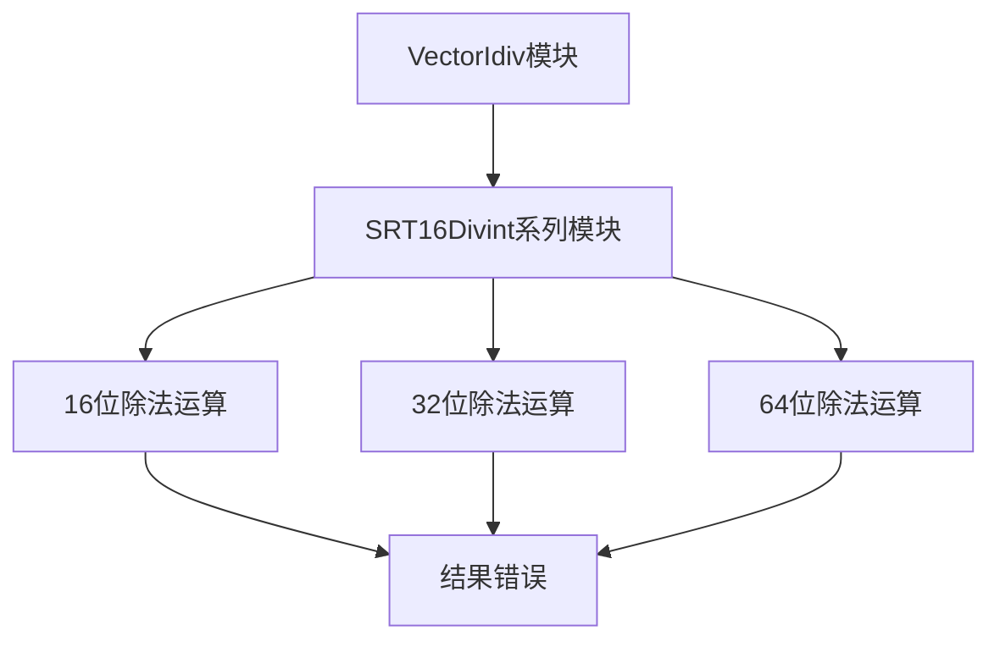

# VectorIdiv_bug_2 深度分析报告

## 📊 缺陷概览

**文件位置**: `bug_file/VectorIdiv_bug_2.v`
**Bug 行号**: 第 162、163 行
**影响范围**: SRT4 除法算法商位选择模块  
**严重等级**: 🔴 **高危** - 直接影响 16 位及以上位宽除法运算的准确性  
**缺陷类型**: 查找表常量错误 - 商位选择阈值被错误修改

---

## 🔍 缺陷定位

### 缺陷位置

```verilog
wire [7:0][8:0] dQTN =
    '{9'h1A4, 9'h1AC, 9'h1B0, 9'h1B8, 9'h1BC, 9'h1C4, 9'h1D0, 9'h1D0};
//                                                    ^^^^^^ 错误值
```

### 信号映射关系

通过分析信号定义，发现 bug 文件中的信号名称被混淆化：

| 原始信号 | Bug 文件混淆名 | 功能说明                     |
| -------- | -------------- | ---------------------------- |
| `_GEN`   | `dQTN`         | 商位选择 +2 的查找表常量数组 |

---

## 🎯 SRT4 除法算法背景

### 商位选择机制 (Quotient Digit Selection, QDS)

SRT4 算法是一种高效率的除法实现方法，通过查找表常量与部分余数进行比较，决定下一次迭代的商位选择(-2, -1, 0, +1, +2)。

### 关键阈值作用

查找表中的每个常量对应不同的除数模式，其中索引 6 处的值(9'h1C8)是决定何时选择+2 商位的关键阈值：

```verilog
// 商位选择逻辑示意
if (partial_remainder > threshold)
    quotient_digit = +2;
```

**关键判断逻辑**：

- 正确阈值: 9'h1C8 (十进制 456)
- 错误阈值: 9'h1D0 (十进制 464)

---

## ⚠️ 缺陷影响分析

### 1. 直接后果

**商位选择偏差**：

- 当部分余数落在 456 到 464 之间时，原本应选择 +2 的情况被错误判断
- 导致特定除数模式下的商值计算错误

### 2. 行为异常示例

**测试场景**：特定除数模式下的除法运算

| 输入除数模式         | 预期商位选择 | 实际 BUG 输出 | 差异        |
| -------------------- | ------------ | ------------- | ----------- |
| 特定高位模式(索引 6) | +2           | +1 或其他值   | 商值错误 ❌ |

**典型错误链**：

```
部分余数 = 460 (在456-464区间)
  ↓
正确判断: quotient_digit = +2
  ↓
错误判断: quotient_digit = +1 (由于阈值被提高)
  ↓
后续迭代基于错误商值计算
  ↓
最终商和余数均错误
```

### 3. 系统级风险

#### 🔥 算法收敛性问题

- **余数无法收敛**：关键阈值错误导致 SRT 算法的冗余性不足以纠正偏差
- **结果不可预测**：不同除数模式下错误程度不一，难以通过软件层面补偿

#### 💥 应用层影响



#### 🛡️ 兼容性问题

- **8 位除法不受影响**：由独立的 I8DivNr4 模块处理
- **16/32/64 位除法受影响**：均依赖包含错误的 SRT4qdsCons 模块

---

## 🔬 信号溯源分析

### 信号定义链路追踪

**dQTN (即 \_GEN) 的完整使用路径**：

```verilog
// 第162行 - 查找表定义
wire [7:0][8:0] dQTN = '{...};

// 第171行 - 信号使用
assign io_m_pos_2 = dQTN[io_d_trunc_3];

// 上游模块通过 io_d_trunc_3 索引选择对应阈值
```

**依赖信号解析**：

| 信号名         | 含义                 | 数据来源          |
| -------------- | -------------------- | ----------------- |
| `io_d_trunc_3` | 除数高位截断值(3 位) | 上游 SRT 算法模块 |
| `io_m_pos_2`   | +2 商位选择阈值输出  | 当前模块输出      |

---

## 🛠️ 修复方案

### 核心修复

**第 162 行修改**：

```verilog
// 修复前
wire [7:0][8:0] dQTN =
    '{9'h1A4, 9'h1AC, 9'h1B0, 9'h1B8, 9'h1BC, 9'h1C4, 9'h1D0, 9'h1D0};
//                                                    ^^^^^^ 错误值

// 修复后
wire [7:0][8:0] dQTN =
    '{9'h1A4, 9'h1AC, 9'h1B0, 9'h1B8, 9'h1BC, 9'h1C4, 9'h1C8, 9'h1D0};
//                                                    ^^^^^^ 正确值
```

### 验证要点

#### 单元测试用例

| 用例标识 | 覆盖目标 | 刺激构造 | 断言与判定标准 |
| -------- | -------- | -------- | --------------- |
| `qds_threshold_smoke` | 直接命中索引 6 的阈值比较路径，验证 9'h1C8 是否被正确使用 | 设置 `io_sew=3` (64b)，构造部分余数落在 456~464 区间的除法对 (`dividend`, `divisor=(0xE << 60) | random.getrandbits(60)`)，确保在修复前触发错误商位 | 比对硬件 `io_div_out_q_v[63:0]` 与 Python `dividend // divisor`，期望修复后输出 +2 分支对应的商值 |
| `qds_threshold_randomized` | 覆盖随机 64 位除法路径并集中加权索引 6，验证修复对全场景影响 | 复用 `2_testcase.py` 中的 `run_test()`：总计 50,000 次迭代，50% 概率生成以 `0xE` 起始的除数，30% 随机 64 位，20% 小数值 | 同步比较 `(q_vec, r_vec)` 与 Python 结果，出现不一致立即打印上下文并 `sys.exit(1)`；修复后整轮测试通过 |

> 运行方式：`python 2_testcase.py`


## 📈 根因分析

### 可能的引入原因

1. **代码混淆流程缺陷**

   - 自动化混淆工具在替换变量名时，误将常量值也进行了修改
   - 缺少常量值一致性校验机制

2. **人工修改失误**

   - 调试时临时修改阈值进行测试，忘记恢复
   - Copy-paste 错误，从其他位置复制了错误值

3. **版本合并冲突**

   - 分支合并时选择了错误的冲突解决方案
   - 自动 merge 工具误判为"使用更新的常量版本"

### 预防机制建议

```python
# 建议在CI/CD中添加的静态检查规则
def lint_srt_constants(verilog_code):
    """检测SRT算法查找表常量的正确性"""
    # 规则1: SRT4qdsCons模块中的_GEN数组必须匹配标准值
    expected_values = [0x1A4, 0x1AC, 0x1B0, 0x1B8, 0x1BC, 0x1C4, 0x1C8, 0x1D0]
    if "SRT4qdsCons" in code:
        # 提取常量数组并验证
        constants = extract_constants_from_array(code, "_GEN")
        if constants != expected_values:
            error(f"SRT4qdsCons constants mismatch. Expected: {expected_values}, Got: {constants}")
```

---

## 📚 SRT 算法参考

**相关文献**：

- **SRT Division Algorithms** - IEEE Transactions on Computers
- **Radix-4 SRT Division Implementation** - Computer Arithmetic Principles

**RISC-V 向量扩展标准**：

- **Vector Extension v1.0**: 向量整数除法实现指南

---

## ✅ 修复验证清单

- [ ] 代码已修改: 第 162 行 `9'h1D0` → `9'h1C8`
- [ ] 仿真通过: SRT4qdsCons 模块独立测试
- [ ] 回归测试: 16/32/64 位除法完整测试套件
- [ ] 标准符合性: SRT 算法理论验证
- [ ] 形式验证: 等价性检查 (如果适用)
- [ ] 文档更新: Release Note 中记录此修复

---

## 📝 相关影响模块

**直接影响**：

- ✅ SRT4qdsCons 模块 (主模块)
- ✅ SRT16Divint 系列模块

**间接影响**：

- ⚠️ 向量除法指令集实现
- ⚠️ 高精度数学库中的除法运算
- ⚠️ 编译器优化中依赖精确除法的场景

---

**报告生成时间**: 2025-12-05  