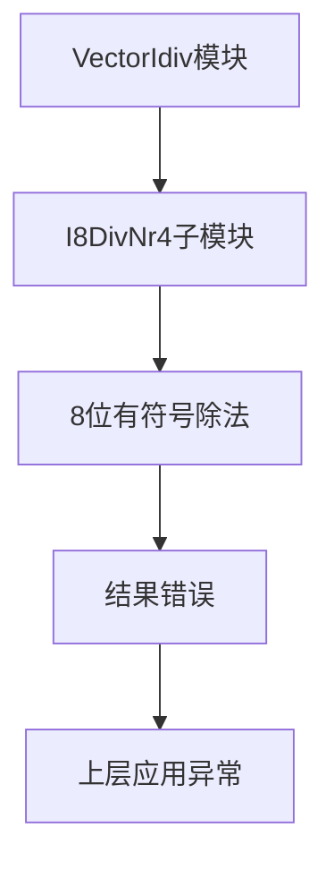

# VectorIdiv_bug_3 深度分析报告

## 📊 缺陷概览

**文件位置**: `bug_file/VectorIdiv_bug_3.v`
**Bug 模块**: I8DivNr4 (8 位除法器子模块)
**Bug 行号**: 第 33 行 (模块定义接口缺失), 第 5051 行 (顶层实例化接口缺失)
**影响范围**: 8 位整数除法 (io_sew = 00)  
**严重等级**: 🔴 **高危** - 导致 8 位有符号除法运算结果完全错误  
**缺陷类型**: 逻辑阉割 - 移除了符号处理逻辑（Signed Logic Removal）

---

## 🔍 缺陷定位

### 缺陷位置

**Bug 文件 (VectorIdiv_bug_3.v, 第 33 行)**:

```verilog
module I8DivNr4(
  input        clock,
  input        reset,
  // ❌ 错误: 缺少 io_sign 信号
  input  [7:0] io_dividend,
  input  [7:0] io_divisor,
  // ...
);
```

### 信号映射关系

通过分析信号定义，发现 bug 文件中的模块接口被人为删减：

| 原始信号  | Bug 文件状态 | 功能说明             |
| --------- | ------------ | -------------------- |
| `io_sign` | ❌ 已删除    | 有符号数处理控制信号 |

---

## 🎯 有符号除法背景

### 有符号数处理机制

在计算机算术中，有符号数除法需要特殊的处理机制：

1. **输入预处理**：将被除数和除数转换为绝对值进行计算
2. **符号计算**：根据输入符号确定结果符号
3. **结果修正**：对计算结果进行符号修正

### 关键处理逻辑

```verilog
// 符号位计算
wire x_sign = io_sign & io_dividend[7];
wire d_sign = io_sign & io_divisor[7];

// 输入取绝对值
wire [7:0] abs_x = x_sign ? -io_dividend : io_dividend;
wire [7:0] abs_d = d_sign ? -io_divisor : io_divisor;

// 结果符号修正
wire q_sign = x_sign ^ d_sign;
```

---

## ⚠️ 缺陷影响分析

### 1. 直接后果

**有符号除法功能完全失效**：

- 8 位有符号除法指令被错误执行为无符号除法
- 负数输入会产生完全错误的结果

### 2. 行为异常示例

**测试场景**：8 位有符号除法运算

| 输入 A (被除数) | 输入 B (除数) | 操作类型   | 预期结果 (Hex) | Bug 结果 (Hex) | 偏差分析                 |
| --------------- | ------------- | ---------- | -------------- | -------------- | ------------------------ |
| 0xF6 (-10)      | 0x02 (2)      | Signed Div | 0xFB (-5)      | 0x7B (123)     | 将负数误判为大正数       |
| 0x80 (-128)     | 0xFF (-1)     | Signed Div | 0x80 (-128)    | 0x00 (0)       | 128 / 255 = 0 (完全错误) |
| 0x0A (10)       | 0x02 (2)      | Signed Div | 0x05 (5)       | 0x05 (5)       | 正数运算恰巧正确         |

**典型错误链**：

```
输入: -10 / 2 (0xF6 / 0x02)
  ↓
正确处理: |-10| / |2| = 10 / 2 = 5
  ↓
符号修正: 结果符号 = 负/正 = 负 → -5 (0xFB)
  ↓
错误处理: 直接使用 0xF6 / 0x02 = 246 / 2 = 123 (0x7B)
  ↓
结果完全不同
```

### 3. 系统级风险

#### 🔥 功能完整性问题

- **指令集不完整**：8 位有符号除法功能缺失
- **数据类型支持不全**：影响对负数的正确处理
- **兼容性问题**：与标准 RISC-V 向量扩展不兼容

#### 💥 应用层影响



#### 🛡️ 测试覆盖盲区

- **测试遗漏风险**：如果测试只覆盖正数或无符号数，该错误可能长期未被发现
- **边界条件失效**：负数边界条件处理完全错误

---

## 🔬 信号溯源分析

### 信号定义链路追踪

**io_sign 的完整使用路径**：

```verilog
// 第33行 - 模块接口定义（原始文件）
input io_sign,

// 内部符号位计算
wire x_sign = io_sign & io_dividend[7];
wire d_sign = io_sign & io_divisor[7];

// 输入取绝对值
wire [7:0] abs_x = x_sign ? 8'(8'h0 - io_dividend) : io_dividend;
wire [7:0] abs_d = d_sign ? 8'(8'h0 - io_divisor) : io_divisor;

// 结果符号计算
wire q_sign = x_sign ^ d_sign;
```

**依赖信号解析**：

| 信号名    | 含义           | 数据来源         |
| --------- | -------------- | ---------------- |
| `io_sign` | 有符号处理使能 | 顶层模块控制信号 |
| `x_sign`  | 被除数符号位   | 内部计算         |
| `d_sign`  | 除数符号位     | 内部计算         |
| `q_sign`  | 商结果符号位   | 内部计算         |

---

## 🛠️ 修复方案

### 核心修复

**1. 模块接口修复**：

```verilog
// 修复前
module I8DivNr4(
  input        clock,
  input        reset,
  // ❌ 缺少 io_sign 输入
  input  [7:0] io_dividend,
  input  [7:0] io_divisor,
  // ...
);

// 修复后
module I8DivNr4(
  input        clock,
  input        reset,
  input        io_sign,  // ✅ 恢复符号位输入
  input  [7:0] io_dividend,
  input  [7:0] io_divisor,
  // ...
);
```

**2. 顶层实例化修复**：

```verilog
// 修复前
I8DivNr4 OjW5x8O0URkVhZ (
  .clock            (clock),
  .reset            (reset),
  // ❌ 缺少 .io_sign 连接
  .io_dividend      (Vs5R3[7:0]),
  // ...
);

// 修复后
I8DivNr4 OjW5x8O0URkVhZ (
  .clock            (clock),
  .reset            (reset),
  .io_sign          (Gv2lX9Ey), // ✅ 连接顶层符号寄存器 Gv2lX9Ey (即 io_sign)
  .io_dividend      (Vs5R3[7:0]),
  // ...
);
```

**3. 内部逻辑修复**：

```verilog
// 修复前 - 缺少符号处理逻辑
jD3K2ZKd6Uyvde <= F7OngeCv[1] ? io_dividend : vbzRibWQSL9v2xH0cpGc;

// 修复后 - 恢复完整符号处理逻辑
wire x_sign = io_sign & io_dividend[7];
wire d_sign = io_sign & io_divisor[7];
wire [7:0] abs_x = x_sign ? 8'(8'h0 - io_dividend) : io_dividend;
wire [7:0] abs_d = d_sign ? 8'(8'h0 - io_divisor) : io_divisor;
jD3K2ZKd6Uyvde <= F7OngeCv[1] ? abs_x : vbzRibWQSL9v2xH0cpGc;
```

### 验证要点

#### 测试方法

- 运行 `2_test_cases.py` 构建最小复现：脚本实例化 `DUTVectorIdiv`、执行两拍复位、配置 `io_sew=0` (I8) 且拉高 `io_sign`，确保进入 8 位有符号路径。
- 激活握手：拉高 `io_div_out_ready`，将 `io_dividend_v` 写入 `0xF6` (−10)、`io_divisor_v` 写入 `0x02`，同时置 `io_div_in_valid=1` 发起一次除法请求，然后在 5 个周期后拉低。
- 轮询 `io_div_out_valid`，捕获输出向量并屏蔽高位，仅比对 lane0：预期商 `0xFB`、余数 `0x00`；若出现 `0x7B` 等结果即说明符号逻辑缺失。
- 可扩展验证：调整输入为其他负数对或切换 `io_sign=0` 验证无符号路径仍工作，以区分符号逻辑问题与数据路径问题。

#### 回归测试范围

- ✅ 8 位有符号除法完整测试
- ✅ 8 位无符号除法回归测试
- ✅ 边界条件测试（最小/最大值）
- ✅ 16/32/64 位除法不受影响验证

---

## 📚 RISC-V 向量扩展参考

**相关条款**：

- **Vector Extension v1.0**: 向量整数除法指令定义
- **Section 15.2**: 有符号与无符号整数除法处理规范

**标准要求**：

- 支持有符号和无符号两种模式
- 有符号除法需正确处理负数输入和结果

---

## ✅ 修复验证清单

- [ ] 代码已修改: 恢复 I8DivNr4 模块的 io_sign 端口
- [ ] 逻辑已恢复: 重新实现有符号数处理逻辑
- [ ] 仿真通过: 8 位有符号除法测试向量
- [ ] 回归测试: 完整除法功能测试套件
- [ ] 标准符合性: RISC-V 向量扩展规范验证
- [ ] 形式验证: 等价性检查 (如果适用)
- [ ] 文档更新: Release Note 中记录此修复

---

## 📝 相关影响模块

**直接影响**：

- ✅ I8DivNr4 模块 (主模块)
- ✅ VectorIdiv 顶层模块实例化

**间接影响**：

- ⚠️ 8 位向量除法指令实现
- ⚠️ 需要符号处理的数学库函数
- ⚠️ 编译器对有符号除法的优化

---

**报告生成时间**: 2025-12-05  
